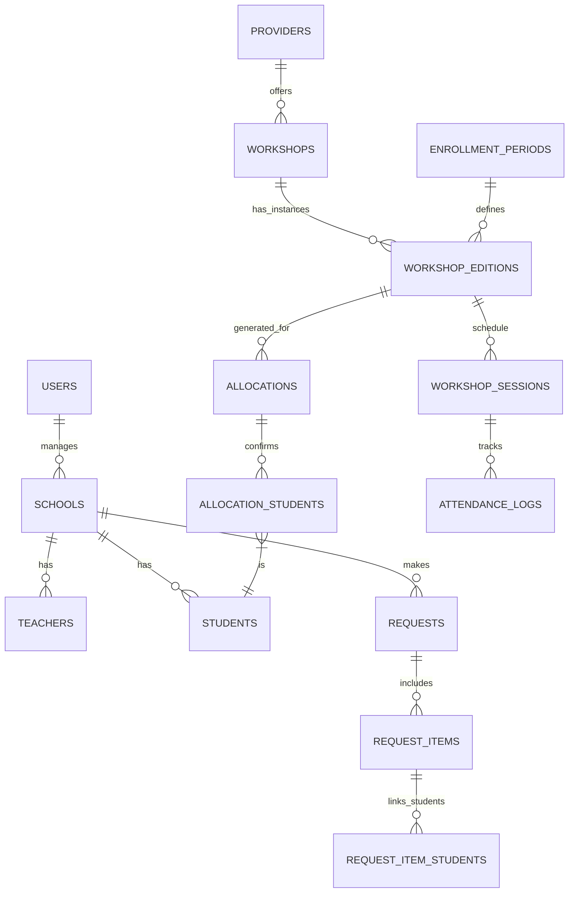

# 🗄️ Base de Dades

## Visió General

Enginy utilitza **PostgreSQL 15** com a sistema de gestió de base de dades relacional. L'esquema està dissenyat per suportar el flux complet de sol·licituds, assignacions i seguiment de tallers educatius.

## Diagrama Entitat-Relació (Simplificat)

---

## Taules Principals

### 🔐 Autenticació i Usuaris

#### `users`
Usuaris del sistema amb accés web (admin i coordinadors).

| Columna | Tipus | Descripció |
|---------|-------|------------|
| `id` | UUID PK | Identificador únic |
| `email` | VARCHAR(255) | Email d'accés (Unique) |
| `full_name` | VARCHAR(255) | Nom complet |
| `role` | user_role_enum | ADMIN, CENTER_COORD, TEACHER |
| `password_hash` | VARCHAR(255) | Contrasenya hashejada |
| `created_at` | TIMESTAMP | Data de creació |

#### `teachers`
Professors acompanyants dels centres. Accedeixen per magic link o credencials per passar llista.

| Columna | Tipus | Descripció |
|---------|-------|------------|
| `id` | UUID PK | Identificador únic |
| `school_id` | UUID FK | Centre al que pertany |
| `full_name` | VARCHAR(255) | Nom complet |
| `email` | VARCHAR(255) | Email (per notificacions/login) |
| `phone_number` | VARCHAR(50) | Telèfon de contacte |
| `password_hash` | VARCHAR(255) | Contrasenya (opcional per login) |
| `user_id` | UUID FK | Vincle a compte d'usuari (si existeix) |

---

### 🏫 Centres i Alumnes

#### `schools`
Centres educatius participants.

| Columna | Tipus | Descripció |
|---------|-------|------------|
| `id` | UUID PK | Identificador únic |
| `code` | VARCHAR(50) | Codi oficial del centre |
| `name` | VARCHAR(255) | Nom del centre |
| `coordinator_user_id`| UUID FK | Usuari coordinador principal |
| `address` | TEXT | Adreça completa |
| `postal_code` | VARCHAR(10) | Codi postal |
| `municipality` | VARCHAR(100)| Municipi |
| `phone` | VARCHAR(50) | Telèfon de contacte |
| `email` | VARCHAR(255) | Email general |

#### `students`
Alumnes dels centres.

| Columna | Tipus | Descripció |
|---------|-------|------------|
| `id` | UUID PK | Identificador únic |
| `school_id` | UUID FK | Centre al que pertany |
| `nombre_completo` | VARCHAR(255)| Nom i cognoms |
| `email` | VARCHAR(255)| Email de l'alumne |
| `curso` | VARCHAR(20) | Curs ('3 ESO', '4 ESO') |
| `tutor_nombre` | VARCHAR(255)| Nom del tutor legal |
| `tutor_email` | VARCHAR(255)| Email del tutor |
| `tutor_telefono` | VARCHAR(50) | Telèfon del tutor |
| `check_...` | SMALLINT | Flags de documentació (0/1) |

---

### 📚 Tallers i Catàleg

#### `providers`
Entitats que ofereixen tallers.

| Columna | Tipus | Descripció |
|---------|-------|------------|
| `id` | UUID PK | Identificador únic |
| `name` | VARCHAR(255) | Nom del proveïdor |
| `address` | TEXT | Adreça |
| `contact_email` | VARCHAR(255) | Email de contacte |

#### `workshops`
Definició genèrica dels tallers.

| Columna | Tipus | Descripció |
|---------|-------|------------|
| `id` | UUID PK | Identificador únic |
| `title` | VARCHAR(255) | Títol del taller |
| `description` | TEXT | Descripció detallada |
| `ambit` | VARCHAR(100)| Àmbit temàtic |
| `provider_id` | UUID FK | Proveïdor |

#### `workshop_editions`
Instàncies concretes d'un taller (dia i hora específics).

| Columna | Tipus | Descripció |
|---------|-------|------------|
| `id` | UUID PK | Identificador únic |
| `workshop_id` | UUID FK | Taller pare |
| `enrollment_period_id`| UUID FK | Període associat |
| `term` | ENUM | Trimestre (2n, 3r) |
| `day_of_week` | ENUM | Dia (TUESDAY, THURSDAY) |
| `start_time` | TIME | Hora inici |
| `end_time` | TIME | Hora fi |
| `capacity_total` | INT | Capacitat màxima |

---

### 📋 Sol·licituds i Assignacions

#### `requests`
Sol·licituds generals d'un centre per a un període.

| Columna | Tipus | Descripció |
|---------|-------|------------|
| `id` | UUID PK | Identificador únic |
| `enrollment_period_id`| UUID FK | Període |
| `school_id` | UUID FK | Centre sol·licitant |
| `is_first_time...` | BOOLEAN | És la primera vegada? |
| `available_for_tuesdays`| BOOLEAN | Disponibilitat dimarts |
| `status` | ENUM | DRAFT, SUBMITTED |

#### `request_items`
Detall de la sol·licitud (Prioritats).

| Columna | Tipus | Descripció |
|---------|-------|------------|
| `id` | UUID PK | Identificador únic |
| `request_id` | UUID FK | Sol·licitud pare |
| `workshop_edition_id` | UUID FK | Taller sol·licitat |
| `priority` | INT | Ordre de preferència |
| `requested_students` | INT | Alumnes sol·licitats |

#### `allocations`
Assignacions finals generades per l'algoritme.

| Columna | Tipus | Descripció |
|---------|-------|------------|
| `id` | UUID PK | Identificador únic |
| `workshop_edition_id` | UUID FK | Taller assignat |
| `school_id` | UUID FK | Centre beneficiari |
| `assigned_seats` | INT | Places atorgades |
| `status` | ENUM | PROVISIONAL, PUBLISHED, etc. |

---

### 📅 Sessions i Assistència

#### `workshop_sessions`
Sessions individuals del calendari.

| Columna | Tipus | Descripció |
|---------|-------|------------|
| `id` | UUID PK | Identificador únic |
| `workshop_edition_id` | UUID FK | Edició |
| `date` | DATE | Data real |
| `session_number` | INT | Número de sessió |

#### `attendance_logs`
Registre d'assistència.

| Columna | Tipus | Descripció |
|---------|-------|------------|
| `id` | UUID PK | Identificador únic |
| `session_id` | UUID FK | Sessió |
| `student_id` | UUID FK | Alumne |
| `status` | ENUM | PRESENT, ABSENT, LATE... |
| `observation` | TEXT | Comentaris |

---

### 📂 Gestió Documental

#### `student_documents`
Arxius pujats associats als alumnes.

| Columna | Tipus | Descripció |
|---------|-------|------------|
| `id` | UUID PK | Identificador únic |
| `student_id` | UUID FK | Alumne |
| `document_type` | ENUM | AUTORITZACIO..., DNI... |
| `file_url` | VARCHAR | Ruta/URL del fitxer |
| `is_verified` | BOOLEAN | Estat de validació |

---

### ⭐ Avaluacions

#### `student_grades`
Avaluació de competències transversals i tècniques.

| Columna | Tipus | Descripció |
|---------|-------|------------|
| `id` | UUID PK | Identificador únic |
| `student_id` | UUID FK | Alumne avaluat |
| `workshop_edition_id` | UUID FK | Context de l'avaluació |
| `tech_...` | INT | Puntuacions tècniques (1-5) |
| `teamwork`, ... | INT | Competències toves (1-5) |

#### `surveys` i `survey_responses`
Enquestes de satisfacció configurables.

---

## Notes Tècniques

- Totes les taules utilitzen **UUID** com a clau primària (`uuid_generate_v4()`).
- Els timestamps utilitzen `TIMESTAMP WITH TIME ZONE` o `TIMESTAMP DEFAULT NOW()`.
- S'utilitzen ENUMs per a camps d'estat i tipus limitats.
